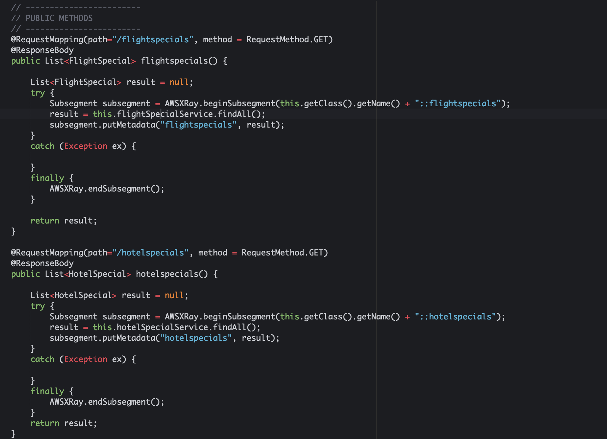
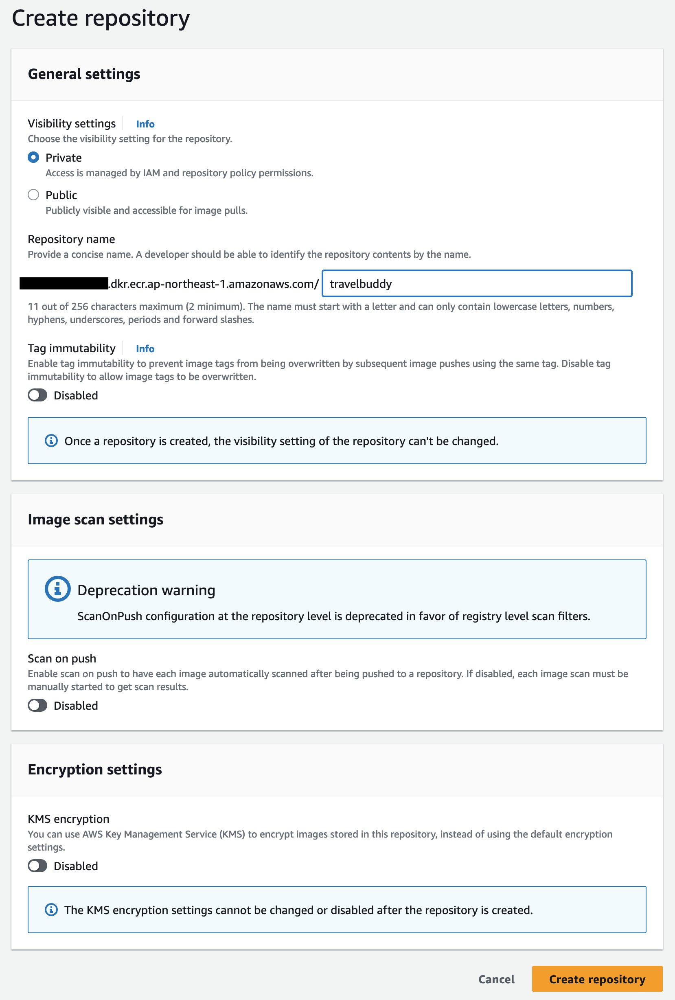
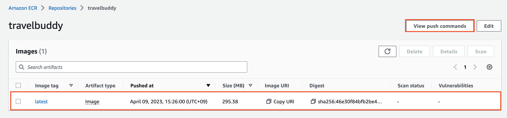

# TravelBuddy 컨테이너화하기

이 실습에서는 TravelBuddy 애플리케이션을 컨테이너화 하는 방법을 학습니다. 기존에 운영중인 Java와 maven을 이용하는 TravelBuddy 애플리케이션이 제공되므로, 우리는 처음부터 애플리케이션을 빌드하는 대신 컨테이너화 하는 것에만 집중하여 학습을 진행합니다.

## 준비하기

먼저 다음과 같이 `~/environment`에 [TravelBuddy.zip](https://workshops.devax.academy/monoliths-to-microservices/module1/files/TravelBuddy.zip) 파일을 받아서 압축해제합니다.

```bash
# 폴더 이동
cd ~/environment

# 다운로드 및 압축해제
wget https://workshops.devax.academy/monoliths-to-microservices/module1/files/TravelBuddy.zip
unzip TravelBuddy.zip
```

## 프로젝트 살펴보기

먼저 REST API를 구현하고 있는 `TravelBuddy > src > main > java > devlounge > spring > RESTController.java`를 살펴봅니다.

`/flightspecials`와 `/hotelspecials` API를 확인할 수 있습니다.



대략 어떤 구조를 가지고 동작하는지 코드를 좀 더 살펴봅니다.

## 빌드하기

이 프로젝트는 CodeBuild 용 buildspec.yml 파일을 포함하고 있습니다. buildspec.yml 파일의 내용을 통해 빌드 방법을 확인합니다.

빌드를 위한 Dockerfile을 작성해봅니다.

```Dockerfile
FROM openjdk:8-jdk

WORKDIR /app
COPY pom.xml .
COPY src /app/src

RUN apt-get update && apt-get install -y wget && \
    wget http://mirror.olnevhost.net/pub/apache/maven/maven-3/3.3.9/binaries/apache-maven-3.3.9-bin.tar.gz && \
    tar xzvf apache-maven-3.3.9-bin.tar.gz -C /opt/

RUN export PATH=/opt/apache-maven-3.3.9/bin:$PATH && \
    mvn -f pom.xml compile war:exploded
```

```bash
# docker 이미지 빌드
docker build -t travelbuddy .

# 파일시스템 탐색을 위한 shell 실행
docker run -it --rm travelbuddy /bin/bash
```

```Dockerfile
FROM maven:3.3.9-jdk-8 AS build

WORKDIR /app
COPY pom.xml .
RUN mvn dependency:go-offline
COPY src ./src
RUN mvn -f pom.xml clean package

FROM tomcat:9-jdk11

COPY --from=build /app/target/*.war /usr/local/tomcat/webapps/travelbuddy.war
EXPOSE 8080

# Unprivileged user setup
RUN groupadd --gid 1000 tomcat \
  && useradd --uid 1000 --gid 1000 \
    --shell /bin/bash --create-home tomcat

USER tomcat
ENTRYPOINT ["catalina.sh", "run"]
```

## ECR에 이미지 푸시하기

ECR에 이미지를 업로드하려면 먼저 레지스트리를 생성해야 합니다. Amazon ECR > Repositories > Create repository를 선택합니다.

Generea settings에서 repository 이름에 travelbuddy를 입력하고 `Create repository` 버튼을 클릭하여 저장소를 생성합니다.



생성한 repository를 클릭한 후 `View push commands` 버튼을 클릭하여 표시되는 가이드대로 Cloud9 터미널에 입력해서 TravelBuddy 이미지를 ECR에 푸시합니다.


